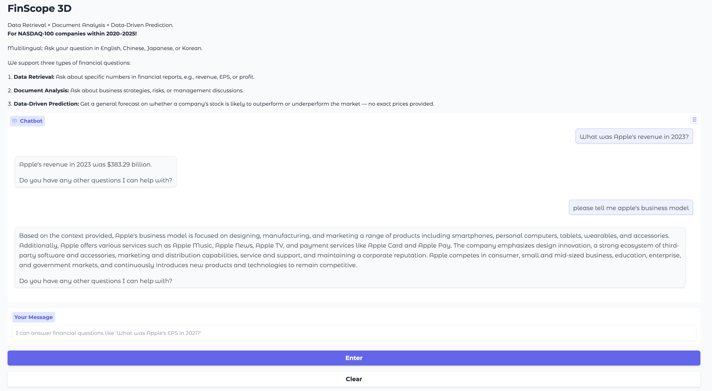

# FinScope3D

### 🧠 A Multimodal Financial Question Answering System

---

## 🌒 Preview (Dark Mode)

---

## 🧩 Overview

**FinScope3D** is a multimodal financial QA system that integrates natural language understanding, named entity recognition (NER), structured and unstructured data processing, and predictive modeling to deliver insightful responses to financial queries.

---

## ⚙️ System Architecture

The system is divided into four major components:

1. **🧠 NER Module**  
   Extracts key entities like companies, dates, metrics, and events using:
   - Hugging Face Transformers  
   - Custom rules for financial domain  

2. **🧾 Structured Data**  
   Handles database queries and structured analysis using:
   - SQLite  
   - OpenAI for semantic understanding  
   - ChromaDB for vector search

3. **📚 Unstructured Data**  
   Retrieves insights from financial transcripts and news using:
   - LangChain  
   - ChromaDB  
   - OpenAI  

4. **📈 Prediction Module**  
   Performs data-driven financial prediction tasks using:
   - LightGBM  
   - Optuna for hyperparameter tuning  
   - Window-based time series techniques  

---

## 🧰 Tech Stack

- **LLMs**: OpenAI, Hugging Face
- **NER**: Hugging Face Transformers
- **Intent Classification**: Custom LLM Agent
- **Vector Store**: ChromaDB
- **Unstructured Query**: LangChain + OpenAI
- **Structured Query**: SQLite + OpenAI
- **Prediction Models**: LightGBM, Optuna
- **Frontend**: Gradio

---

## 📌 Key Features

- 🔎 Intelligent financial entity extraction  
- 🧭 Intent-aware question routing  
- 📊 ML-based financial predictions  
- 💬 Multilingual input/output  
- ⚡ Fast response via lightweight backend  

---

## 📄 License

MIT License

---

## ✨ Contributors

Made with Jay Wu, Ray Chang, Yu-Ting Chen, Ingrid Tseng

## Reference

- Bhaskarjit Sarmah, Benika Hall, Rohan RaoSunil Patel, Stefano Pasquali, Dhagash Mehta HybridRAG: Integrating Knowledge Graphs and Vector Retrieval Augmented Generation for Efficient Information Extraction. (2024).
- https://medium.com/aimonks/mastering-the-waves-of-time-enhancing-predictive-accuracy-with-time-series-cross-validation-4eaccdaaa5e2

